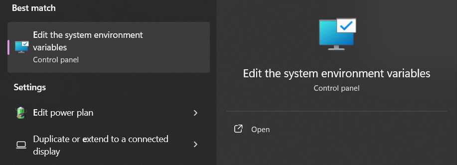

## Install Helm

Install helm from release page: https://github.com/helm/helm/releases

Create "helm" folder under C:\ 

Unzip folder and get helm.exe then move/copy it to C:\helm directory.

Use windows search and search for "environment", select "Edit the system environment variables" then edit the PATH.




Re-open your code editor, try running "helm version".

Output:
```
version.BuildInfo{Version:"v3.16.3", GitCommit:"cfd07493f46efc9debd9cc1b02a0961186df7fdf", GitTreeState:"clean", GoVersion:"go1.22.7"}
```