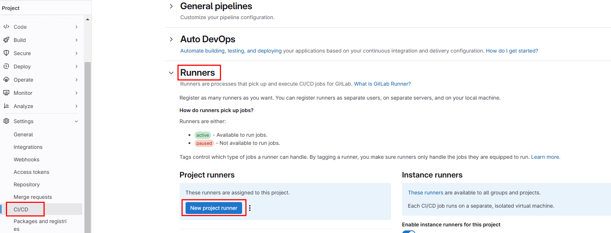

## Deploy GitLab Runner in the Same Kubernetes Cluster

### Add the GitLab Helm Repository
Add the GitLab Helm chart repository:
```bash
helm repo add gitlab https://charts.gitlab.io
helm repo update
```
```bash
helm repo list
```
```
bitnami         https://charts.bitnami.com/bitnami
longhorn        https://charts.longhorn.io        
gitlab          https://charts.gitlab.io
```
### Install GitLab Runner via Helm
Install GitLab Runner into your Kubernetes cluster:

https://docs.gitlab.com/runner/install/kubernetes.html
https://docs.gitlab.com/runner/install/kubernetes_helm_chart_configuration.html

```shell
helm install gitlab-runner gitlab/gitlab-runner `
    --namespace gitlab-runner --create-namespace `
    --set gitlabUrl=https://gitlab.com `
    --set rbac.create=true `
    --set serviceAccount.create=true `
    --set runnerToken=glrt-t3_L5vSwRXE6cUiB8bR-DK2 
```

- **gitlabUrl**: URL of your GitLab instance (e.g., `https://gitlab.com`).
- **rbac.create**: Allows the Runner to create Kubernetes resources using RBAC.
- **serviceAccount.create**: Specifies whether a Role and RoleBinding should be created.If `rbac.create` value is set to `true`, `serviceAccount.create` should also be set to either `true` or `false`
- **runnerToken**: 

### Verify GitLab Runner Deployment

Check that the Runner pod is running:

```bash
kubectl get pods -n gitlab-runner
```
You should see a pod for the GitLab Runner.

Confirm that the Runner is registered in GitLab:
- Go to **Settings > CI/CD > Runners** in your GitLab project.


- Click the runner and see the details such as description, job timeout, last contact, etc.

