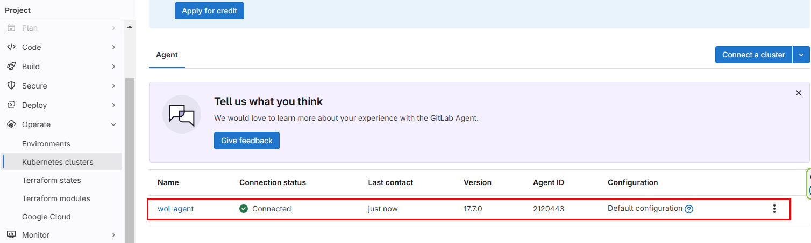

## Deploy gitlab agent




```bash
kubectl get po -n gitlab-agent-wol-agent
```
Output: 

```
NAME                                         READY   STATUS    RESTARTS   AGE
wol-agent-gitlab-agent-v2-549c55c844-l2h2v   1/1     Running   0          2m20s
wol-agent-gitlab-agent-v2-549c55c844-rgwcm   1/1     Running   0          2m20s
```

