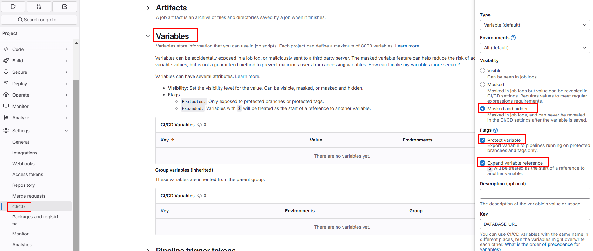
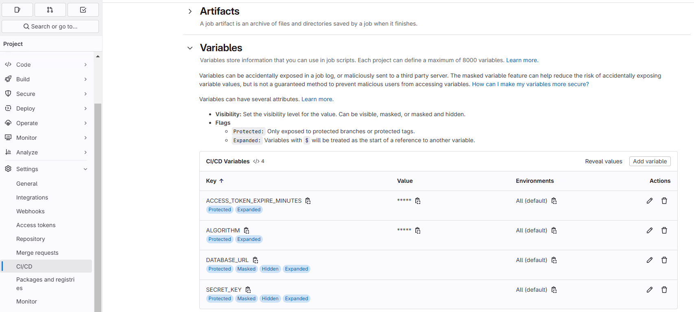

## Deploy with Gitlab Runner

### Create role and rolebinding

The apps will run in works-on-local namespace, we want the gitlab-runner service account in the automation namespace to have the required permissions in the works-on-local namespace. This requires creating a Role in works-on-local and binding it to the gitlab-runner Service Account in automation.

```bash
kubectl get sa -n automation
```
Output:
```
NAME            SECRETS   AGE
default         0         26m
gitlab-runner   0         3m14s
```

Create Role in wol-automation-role.yaml file and use the content below.

```yaml
apiVersion: rbac.authorization.k8s.io/v1
kind: Role
metadata:
  namespace: works-on-local
  name: automation-runner-role
rules:
  - apiGroups: [""]
    resources: ["secrets", "pods", "services", "configmaps", "serviceaccounts"]
    verbs: ["get", "list", "watch", "create", "update", "delete"]
  - apiGroups: ["apps"]
    resources: ["deployments", "replicasets", "statefulsets"]
    verbs: ["get", "list", "watch", "create", "update", "delete"]
```

```bash
kubectl apply -f .\wol-automation-role.yaml
```

```bash
kubectl describe role automation-runner-role -n works-on-local
```

Output
```
Name:         automation-runner-role
Labels:       <none>
Annotations:  <none>
PolicyRule:
  Resources          Non-Resource URLs  Resource Names  Verbs
  ---------          -----------------  --------------  -----
  configmaps         []                 []              [get list watch create update delete]
  pods               []                 []              [get list watch create update delete]
  secrets            []                 []              [get list watch create update delete]
  serviceaccounts    []                 []              [get list watch create update delete]
  services           []                 []              [get list watch create update delete]
  deployments.apps   []                 []              [get list watch create update delete]
  replicasets.apps   []                 []              [get list watch create update delete]
  statefulsets.apps  []                 []              [get list watch create update delete]
```

Create RoleBinding in wol-runner-rolebinding.yaml file. (bind gitlab-runner serviceaccount to this role)

```yaml
apiVersion: rbac.authorization.k8s.io/v1
kind: RoleBinding
metadata:
  namespace: works-on-local
  name: automation-runner-rolebinding
subjects:
  - kind: ServiceAccount
    name: gitlab-runner
    namespace: automation
roleRef:
  kind: Role
  name: automation-runner-role
  apiGroup: rbac.authorization.k8s.io
```

```bash
kubectl apply -f .\wol-runner-rolebinding.yaml
```

See rolebinding by running:
```bash
kubectl describe rolebinding -n works-on-local automation-runner-rolebinding
```
Output:

```
Name:         automation-runner-rolebinding
Labels:       <none>
Annotations:  <none>
Role:
  Kind:  Role
  Name:  automation-runner-role
Subjects:
  Kind            Name           Namespace
  ----            ----           ---------
  ServiceAccount  gitlab-runner  automation
```

### Create Variables

As a consensus, it is not best practice to set every variables/secrets like below.  I continue with this for just testing.





### Create Secret for Registry

You can use my username/password or you can create an access token (under your profile settings) and use it in the command below.
(Access token have expiration date, and if you're using free account you cannot use service account and cannot set "no expiration date")

```shell
kubectl create secret docker-registry gitlab-registry-secret `
  --docker-server=registry.gitlab.com `
  --docker-username='<your-gitlab-user-name> '`
  --docker-password='<your-gitlab-password>' `
  --docker-email=your-email@example.com `
  -n works-on-local
```

### Configure Your Pipeline for Deployment

Use the Kubernetes Runner to deploy your application.

`.gitlab-ci.yml`:

```yaml
stages:
  - deploy

deploy:
  stage: deploy
  tags:
    - wol-kubernetes # Use the tag assigned to your GitLab Runner
  image: alpine/k8s:1.27.3
  script:
    - echo "Setting up Kubernetes context..."
    - kubectl config set-cluster k8s-cluster --server=https://kubernetes.default.svc --insecure-skip-tls-verify=true
    - kubectl config set-credentials deployer --token=$(cat /var/run/secrets/kubernetes.io/serviceaccount/token)
    - kubectl config set-context k8s-context --cluster=k8s-cluster --namespace=works-on-local --user=deployer
    - kubectl config use-context k8s-context
    - echo "Deploying application with Helm..."
    - helm upgrade --install wol-user-service ./helm-chart -n works-on-local --set secrets.DATABASE_URL=$DATABASE_URL --set secrets.SECRET_KEY=$SECRET_KEY --set secrets.ALGORITHM=$ALGORITHM --set secrets.ACCESS_TOKEN_EXPIRE_MINUTES=$ACCESS_TOKEN_EXPIRE_MINUTES --set image.tag=4c287a81a2c5bd6c4df3b8b652c037d4060f6fa6 --set image.repository=registry.gitlab.com/worksonlocal/engineering/wol-user-service --set-json imagePullSecrets='[{"name":"gitlab-registry-secret"}]'

  environment:
    name: dev
    url: http://localhost:8080
  only:
    - main
```

