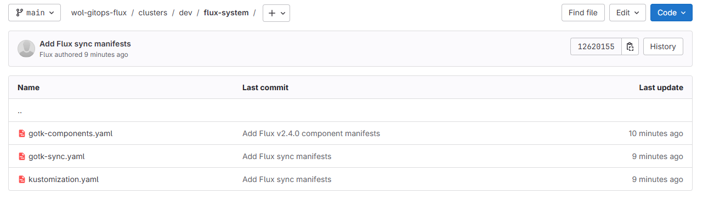

## Flux with Gitlab

### Install Flux CLI

Use the options [in official documentation](https://fluxcd.io/flux/cmd/) according to your OS.

After installation, check the version:

```shell
flux --version
```

Output:
```shell
flux version 2.4.0
```

### Create Gitlab Personal Access Token

Follow the instructions [in official doc](https://docs.gitlab.com/ee/user/profile/personal_access_tokens.html
) and create personal access token. In free gitlab account, personal access token has expiration date.


### Run the bootstrap for a project on your personal GitLab account

Define variable:

For Win:
```shell
$env:GITLAB_TOKEN="your-token"
```
For Linux:
```bash
export GITLAB_TOKEN=your-token
```

```shell
flux bootstrap gitlab `
  --deploy-token-auth `
  --owner=worksonlocal/engineering `
  --repository=wol-gitops-flux `
  --branch=main `
  --path=clusters/dev
```

```bash
kubectl get po -n flux-system
```

Output: 
```
NAME                                       READY   STATUS    RESTARTS   AGE
helm-controller-6f558f6c5d-pfzm2           1/1     Running   0          6m58s
kustomize-controller-74fb56995-tlqw5       1/1     Running   0          6m58s
notification-controller-5d794dd575-n22j5   1/1     Running   0          6m58s
source-controller-6d597849c8-fskxl         1/1     Running   0          6m58s
```

Flux created these files automatically. You'll see this note: "This manifest was generated by flux. DO NOT EDIT." :))



```bash
flux get sources git
```

```
NAME            REVISION                SUSPENDED       READY   MESSAGE
flux-system     main@sha1:12620155      False           True    stored artifact for revision 'main@sha1:12620155'
```

```bash
flux get kustomizations
```

```
NAME            REVISION                SUSPENDED       READY   MESSAGE
flux-system     main@sha1:12620155      False           True    Applied revision: main@sha1:12620155
```