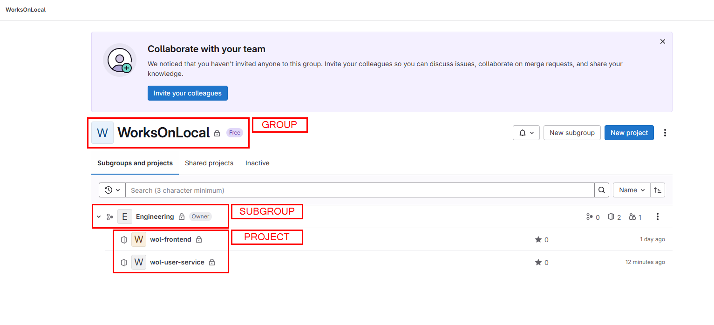

## Gitlab Group/Project Instructions

### Creating a Group

1. Log in to your GitLab instance.
2. In the top navigation bar, click on the **Groups** dropdown and select **Your groups**.
3. Click the **New group** button.
4. Fill in the required details:
   - **Group name**: Enter a name for your group.
   - **Group URL**: This will be auto-generated based on the group name but can be edited.
   - **Visibility Level**: Choose the visibility level (Private, Internal, or Public).
5. Click the **Create group** button.

### Creating a Subgroup

1. Navigate to the group where you want to create a subgroup.
2. In the group navigation bar, click on the **Subgroups** tab.
3. Click the **New subgroup** button.
4. Fill in the required details:
   - **Subgroup name**: Enter a name for your subgroup.
   - **Subgroup URL**: This will be auto-generated based on the subgroup name but can be edited.
   - **Visibility Level**: Choose the visibility level (Private, Internal, or Public).
5. Click the **Create subgroup** button.

### Creating a Project

1. Navigate to the group or subgroup where you want to create a project.
2. In the group or subgroup navigation bar, click on the **Projects** tab.
3. Click the **New project** button.
4. Choose the project creation method:
   - **Create from template**: Use a predefined template.
   - **Create blank project**: Start from scratch.
   - **Import project**: Import from another source.
5. Fill in the required details:
   - **Project name**: Enter a name for your project.
   - **Project slug**: This will be auto-generated based on the project name but can be edited.
   - **Visibility Level**: Choose the visibility level (Private, Internal, or Public).
6. Click the **Create project** button.

### Additional Configuration

- **Add members**: You can add members to your group, subgroup, or project by navigating to the **Members** tab and inviting users.
- **Set permissions**: Configure permissions for different roles (Guest, Reporter, Developer, Maintainer, Owner).

