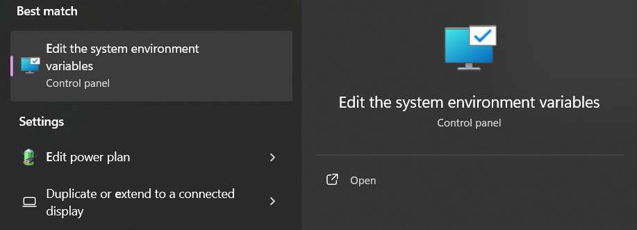

## Setup Database 

### Install Helm

Install helm from release page: https://github.com/helm/helm/releases

Create "helm" folder under C:\ 

Unzip folder and get helm.exe then move/copy it to C:\helm directory.

Use windows search and search for "environment", select "Edit the system environment variables" then edit the PATH.




Re-open your code editor, try running "helm version".

Output:
```
version.BuildInfo{Version:"v3.16.3", GitCommit:"cfd07493f46efc9debd9cc1b02a0961186df7fdf", GitTreeState:"clean", GoVersion:"go1.22.7"}
```

### Deploy Postgresql using Helm

Add bitnami helm repository

```bash
helm repo add bitnami https://charts.bitnami.com/bitnami
```

Check if repo is added 

```bash
helm repo list
```

Output:
```
NAME    URL
bitnami https://charts.bitnami.com/bitnami
```

You can see the bitnami helm repo
```bash
helm search repo bitnami
```

Output:
```
.....
bitnami/phpbb                                   19.0.4          3.3.12          DEPRECATED phpBB is a popular bulletin board th...
bitnami/phpmyadmin                              18.0.0          5.2.1           phpMyAdmin is a free software tool written in P...
bitnami/pinniped                                2.3.5           0.35.0          Pinniped is an identity service provider for Ku...
bitnami/postgresql                              16.2.2          17.2.0          PostgreSQL (Postgres) is an open source object-...
bitnami/postgresql-ha                           15.0.1          17.2.0          This PostgreSQL cluster solution includes the P...
....
```

Deploy the database

```bash
helm install user-service-db bitnami/postgresql \
  --namespace user-service-db \
  --set auth.username=user_service \
  --set auth.password=user_service_password \
  --set auth.database=user_service_db
```