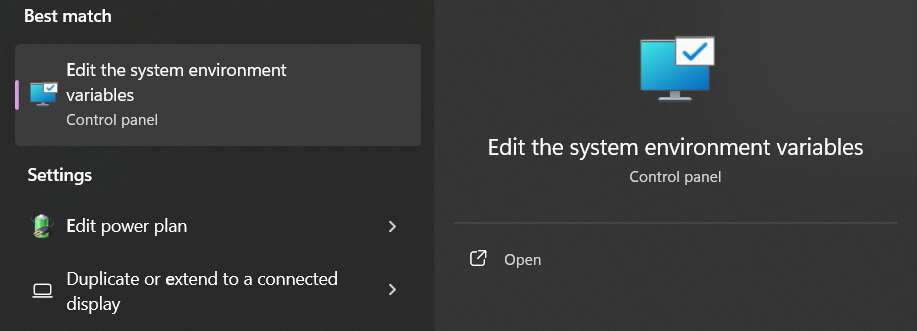
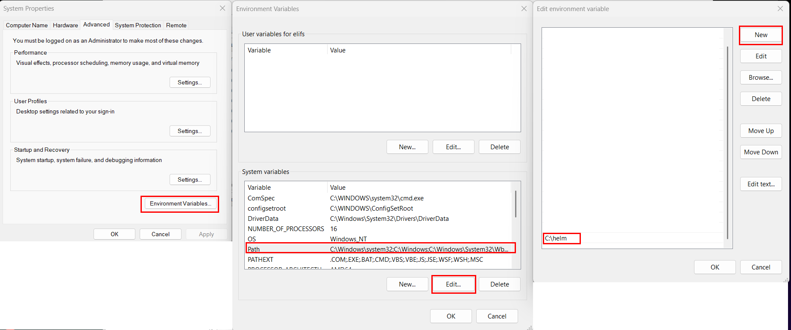

## Setup Database 

### Install Helm

Install helm from release page: https://github.com/helm/helm/releases

Create "helm" folder under C:\ 

Unzip folder and get helm.exe then move/copy it to C:\helm directory.

Use windows search and search for "environment", select "Edit the system environment variables" then edit the PATH.





Re-open your code editor, try running "helm version".

Output:
```
version.BuildInfo{Version:"v3.16.3", GitCommit:"cfd07493f46efc9debd9cc1b02a0961186df7fdf", GitTreeState:"clean", GoVersion:"go1.22.7"}
```

### Deploy Postgresql using Helm

Add bitnami helm repository

```bash
helm repo add bitnami https://charts.bitnami.com/bitnami
```

Check if repo is added 

```bash
helm repo list
```

Output:
```
NAME    URL
bitnami https://charts.bitnami.com/bitnami
```

You can see the bitnami helm repo
```bash
helm search repo bitnami
```

Output:
```
.....
bitnami/phpbb                                   19.0.4          3.3.12          DEPRECATED phpBB is a popular bulletin board th...
bitnami/phpmyadmin                              18.0.0          5.2.1           phpMyAdmin is a free software tool written in P...
bitnami/pinniped                                2.3.5           0.35.0          Pinniped is an identity service provider for Ku...
bitnami/postgresql                              16.2.2          17.2.0          PostgreSQL (Postgres) is an open source object-...
bitnami/postgresql-ha                           15.0.1          17.2.0          This PostgreSQL cluster solution includes the P...
....
```

Create namespace for shared services like db. It's better to place the PostgreSQL database in a shared-services namespace since it's a shared infrastructure component that could be used by multiple applications or services.

```bash
kubectl create namespace shared-services
```

Create PV (Persistent Volume). Most Kubernetes clusters rely on a storage provisioner (e.g., for local disks, cloud provider volumes, or external storage systems) to dynamically allocate Persistent Volumes (PVs) for Persistent Volume Claims (PVCs).

Run this command to install Longhorn (a dynamic storage provisioner) in your cluster.

```bash
helm repo add longhorn https://charts.longhorn.io
```
```bash
kubectl create namespace longhorn-system
```

```bash
helm install longhorn longhorn/longhorn --namespace longhorn-system
```

Deploy the database

```bash
helm install db-0 bitnami/postgresql --namespace shared-services --set auth.postgresPassword=pass --set primary.persistence.size=1Gi
```

You can also set: 
```
  --set primary.resources.requests.cpu=100m 
  --set primary.resources.requests.memory=256Mi
  --set primary.resources.limits.cpu=500m
  --set primary.resources.limits.memory=512Mi
```

Check the resources in shared-services

```bash
kubectl get all -n shared-services
```

Output:

```
NAME                    READY   STATUS    RESTARTS   AGE
pod/db-1-postgresql-0   1/1     Running   0          13m

NAME                         TYPE        CLUSTER-IP     EXTERNAL-IP   PORT(S)    AGE
service/db-1-postgresql      ClusterIP   10.43.252.25   <none>        5432/TCP   13m
service/db-1-postgresql-hl   ClusterIP   None           <none>        5432/TCP   13m

NAME                               READY   AGE
statefulset.apps/db-1-postgresql   1/1     13m
```

### Create Database and User

Connect to the database

```bash
kubectl exec -it db-0-postgresql-0 -n shared-services -- psql -U postgres
```

Create new database, user with password for "production".

```sql
CREATE DATABASE user_service_db;
```
```
postgres=# \l
                                                        List of databases
      Name       |  Owner   | Encoding | Locale Provider |   Collate   |    Ctype    | Locale | ICU Rules |   Access privileges   
-----------------+----------+----------+-----------------+-------------+-------------+--------+-----------+-----------------------
 postgres        | postgres | UTF8     | libc            | en_US.UTF-8 | en_US.UTF-8 |        |           |
 template0       | postgres | UTF8     | libc            | en_US.UTF-8 | en_US.UTF-8 |        |           | =c/postgres          +
                 |          |          |                 |             |             |        |           | postgres=CTc/postgres
 template1       | postgres | UTF8     | libc            | en_US.UTF-8 | en_US.UTF-8 |        |           | =c/postgres          +
                 |          |          |                 |             |             |        |           | postgres=CTc/postgres
 user_service_db | postgres | UTF8     | libc            | en_US.UTF-8 | en_US.UTF-8 |        |           |
(4 rows)
```

```sql
CREATE USER user_service_user WITH PASSWORD 'user_service_pass';
```

```sql
GRANT ALL PRIVILEGES ON DATABASE user_service_db TO user_service_user;
```

```sql
\c user_service_db
```

```sql
GRANT ALL PRIVILEGES ON SCHEMA public TO user_service_user;
```

```sql
SELECT schema_name, grantee, privilege_type FROM information_schema.role_schema_grants;
```

Create new database, user with password for "test".

```sql
CREATE DATABASE user_service_test_db;
```

```sql
CREATE USER user_service_test_user WITH PASSWORD 'user_service_test_pass';
```

```sql
GRANT ALL PRIVILEGES ON DATABASE user_service_test_db TO user_service_test_user;
```

```sql
\c user_service_test_db
```

```sql
GRANT ALL PRIVILEGES ON SCHEMA public TO user_service_test_user;
```

### Temporary port-forwarding to test
```bash
kubectl port-forward db-0-postgresql-0 5432:5432 -n shared-services
```

Note: You cannot use current terminal when you use the command above.