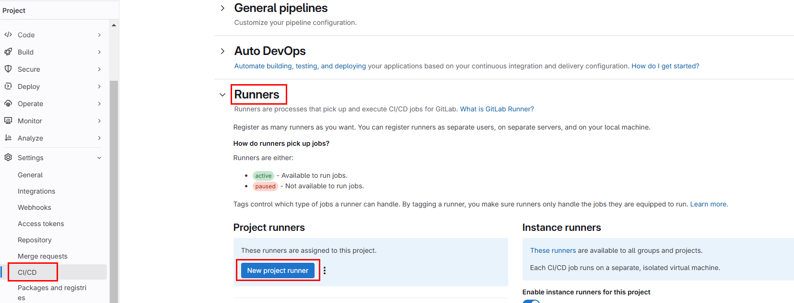
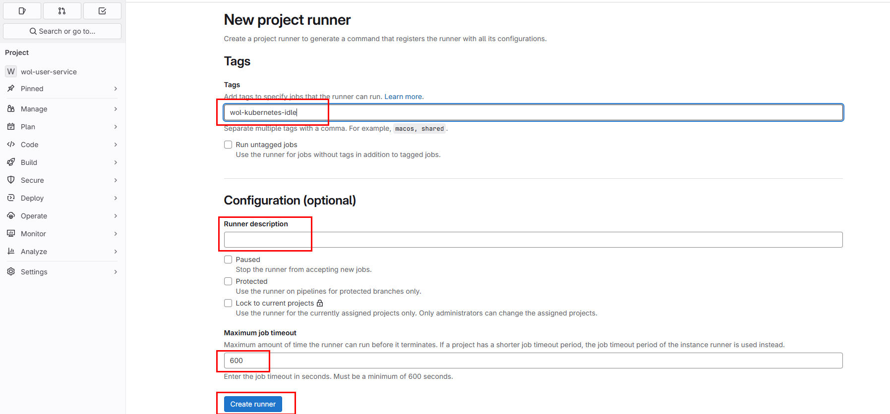
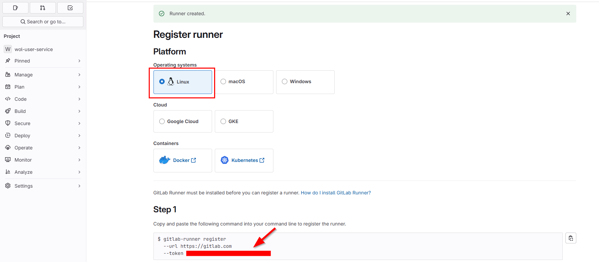
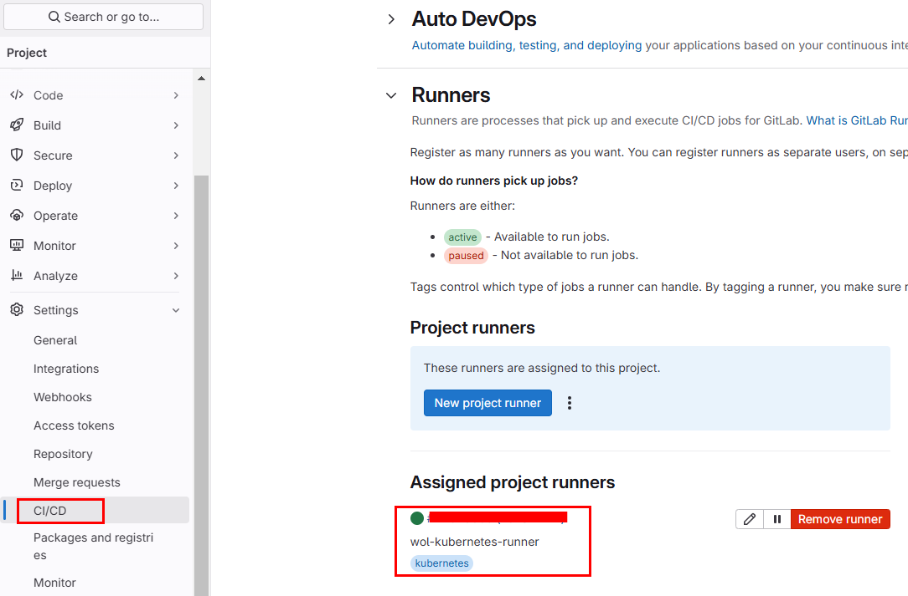

## Deploy GitLab Runner in the Same Kubernetes Cluster

Before starting, go to the Settings > CI/CD > Runners and create new runner.







Keep the token for later use. 

### Add the GitLab Helm Repository
Add the GitLab Helm chart repository:

```bash
helm repo add gitlab https://charts.gitlab.io
helm repo update
```
```bash
helm repo list
```
```
bitnami         https://charts.bitnami.com/bitnami
longhorn        https://charts.longhorn.io        
gitlab          https://charts.gitlab.io
```
### Install GitLab Runner via Helm

Install GitLab Runner into your Kubernetes cluster:

https://docs.gitlab.com/runner/install/kubernetes.html

https://docs.gitlab.com/runner/install/kubernetes_helm_chart_configuration.html

https://gitlab.com/gitlab-org/charts/gitlab-runner/blob/main/values.yaml


Create runner-values.yaml in your local

```shell
helm show values gitlab/gitlab-runner > runner-values.yaml
```

Provide your gitlab-url and token as seen below.

```
## How many old ReplicaSets for this Deployment you want to retain
# revisionHistoryLimit: 10

## The GitLab Server URL (with protocol) that want to register the runner against
## ref: https://docs.gitlab.com/runner/commands/index.html#gitlab-runner-register
##
gitlabUrl: https://gitlab.com
```
```
## The Runner Token for adding new Runners to the GitLab Server. This must
## be retrieved from your GitLab instance. It is the token of an already registered runner.
## ref: (we don't have docs for that yet, but we want to use an existing token)
##
runnerToken: "<your-token-here>"
#
```

Set RBAC and ServiceAccount
```
rbac:
  ## Specifies whether a Role and RoleBinding should be created
  ## If this value is set to `true`, `serviceAccount.create` should also be set to either `true` or `false`
  ##
  create: true
```

```
## Configure ServiceAccount
##
serviceAccount:
  ## Specifies whether a ServiceAccount should be created
  ##
  ## TODO: Set default to `false`
  create: true
  ## The name of the ServiceAccount to use.
  ## If not set and create is `true`, a name is generated using the `gitlab-runner.fullname`` template
  ##
  name: "gitlab-runner"
```

Set service account for runners. If you don't change service_account, runner will use default service account while running jobs. (See: https://gitlab.com/gitlab-org/charts/gitlab-runner/-/issues/353)

```
runners:
  # runner configuration, where the multi line string is evaluated as a
  # template so you can specify helm values inside of it.
  #
  # tpl: https://helm.sh/docs/howto/charts_tips_and_tricks/#using-the-tpl-function
  # runner configuration: https://docs.gitlab.com/runner/configuration/advanced-configuration.html
  config: |
    [[runners]]
      [runners.kubernetes]
        namespace = "{{.Release.Namespace}}"
        image = "alpine"
        service_account = "gitlab-runner"
```

```shell
helm install gitlab-runner gitlab/gitlab-runner `
    --namespace automation --create-namespace `
    -f runner-values.yaml
```

### Verify GitLab Runner Deployment

Check that the Runner pod is running:

```bash
kubectl get pods -n automation
```
You should see a pod for the GitLab Runner.

Confirm that the Runner is registered in GitLab:
- Go to **Settings > CI/CD > Runners** in your GitLab project.
    

- Click the runner and see the details such as description, job timeout, last contact, etc.


