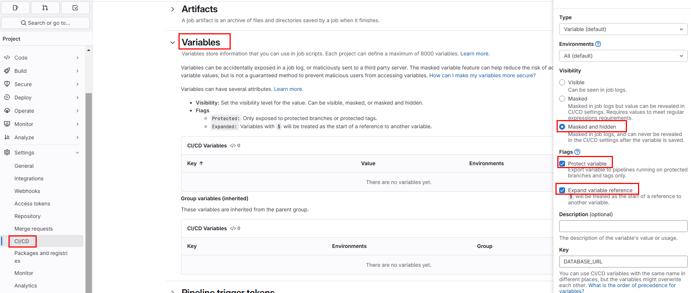
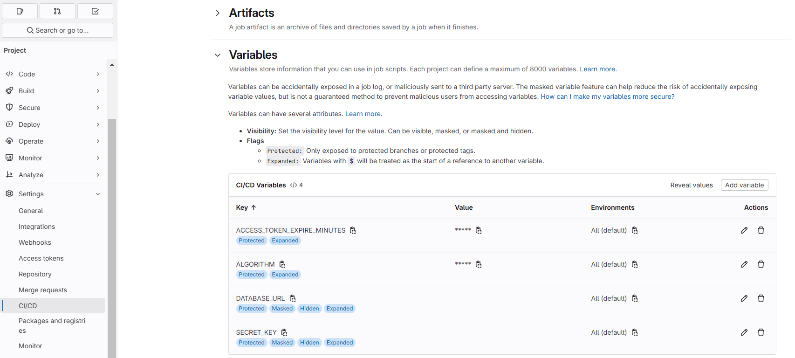

## Deploy with Self-Managed Gitlab Runner

### Create role and rolebinding

The apps will run in works-on-local namespace, we want the gitlab-runner service account in the automation namespace to have the required permissions in the works-on-local namespace. This requires creating a Role in works-on-local and binding it to the gitlab-runner Service Account in automation ns.

```bash
kubectl get sa -n automation
```
Output:
```
NAME            SECRETS   AGE
default         0         26m
gitlab-runner   0         3m14s
```

Create Role in wol-automation-role.yaml file and use the content below.

```yaml
apiVersion: rbac.authorization.k8s.io/v1
kind: Role
metadata:
  namespace: works-on-local
  name: automation-runner-role
rules:
  - apiGroups: [""]
    resources: ["secrets", "pods", "services", "configmaps", "serviceaccounts"]
    verbs: ["get", "list", "watch", "create", "update", "delete", "patch"]
  - apiGroups: ["apps"]
    resources: ["deployments", "replicasets", "statefulsets"]
    verbs: ["get", "list", "watch", "create", "update", "delete","patch"]
```

```bash
kubectl apply -f .\wol-automation-role.yaml
```

```bash
kubectl describe role automation-runner-role -n works-on-local
```

Output
```
Name:         automation-runner-role
Labels:       <none>
Annotations:  <none>
PolicyRule:
  Resources          Non-Resource URLs  Resource Names  Verbs
  ---------          -----------------  --------------  -----
  configmaps         []                 []              [get list watch create update delete]
  pods               []                 []              [get list watch create update delete]
  secrets            []                 []              [get list watch create update delete]
  serviceaccounts    []                 []              [get list watch create update delete]
  services           []                 []              [get list watch create update delete]
  deployments.apps   []                 []              [get list watch create update delete]
  replicasets.apps   []                 []              [get list watch create update delete]
  statefulsets.apps  []                 []              [get list watch create update delete]
```

Create RoleBinding in wol-runner-rolebinding.yaml file. (bind gitlab-runner serviceaccount to this role)

```yaml
apiVersion: rbac.authorization.k8s.io/v1
kind: RoleBinding
metadata:
  namespace: works-on-local
  name: automation-runner-rolebinding
subjects:
  - kind: ServiceAccount
    name: gitlab-runner
    namespace: automation
roleRef:
  kind: Role
  name: automation-runner-role
  apiGroup: rbac.authorization.k8s.io
```

```bash
kubectl apply -f .\wol-runner-rolebinding.yaml
```

See rolebinding by running:
```bash
kubectl describe rolebinding -n works-on-local automation-runner-rolebinding
```

Output:
```
Name:         automation-runner-rolebinding
Labels:       <none>
Annotations:  <none>
Role:
  Kind:  Role
  Name:  automation-runner-role
Subjects:
  Kind            Name           Namespace
  ----            ----           ---------
  ServiceAccount  gitlab-runner  automation
```

To check your authentication for performing something:

```bash
kubectl auth can-i patch deployments --as=system:serviceaccount:automation:gitlab-runner -n works-on-local
```

### Option 1- Create Variables seperately




We'll pass these variables to values.yaml and helm will create secret then use it in deployment.

(What about using it directly without secret?)

### Configure Your Pipeline for Deployment (with option-1 variables)

Use the Kubernetes Runner to deploy your application.

`.gitlab-ci.yml`:

```yaml
stages:
  - deploy

deploy:
  stage: deploy
  tags:
    - wol-kubernetes # Use the tag assigned to your GitLab Runner
  image: alpine/k8s:1.27.3
  script:
    - echo "Setting up Kubernetes context..."
    # Set the Kubernetes cluster with the API server address
    - kubectl config set-cluster k8s-cluster --server=https://kubernetes.default.svc --certificate-authority=/var/run/secrets/kubernetes.io/serviceaccount/ca.crt
    # Use the ServiceAccount token for authentication
    - kubectl config set-credentials deployer --token=$(cat /var/run/secrets/kubernetes.io/serviceaccount/token)
    # Configure the context with the namespace and credentials
    - kubectl config set-context k8s-context --cluster=k8s-cluster --namespace=works-on-local --user=deployer
    # Switch to the configured context
    - kubectl config use-context k8s-context
    
    - echo "Deploying application with Helm..."
    # Perform a Helm upgrade/install
    - |     
      helm upgrade --install wol-user-service ./helm-chart -n works-on-local \
       --set secrets.DATABASE_URL=$DATABASE_URL \
       --set secrets.SECRET_KEY=$SECRET_KEY \
       --set secrets.ALGORITHM=$ALGORITHM \
       --set secrets.ACCESS_TOKEN_EXPIRE_MINUTES=$ACCESS_TOKEN_EXPIRE_MINUTES \
       --set image.tag=4c287a81a2c5bd6c4df3b8b652c037d4060f6fa6 \
       --set image.repository=registry.gitlab.com/worksonlocal/engineering/wol-user-service \
       --set-json imagePullSecrets=' \[{"name":"gitlab-registry-secret"}]'

  environment:
    name: dev
    url: http://localhost:8080
  only:
    - main
```

### Option 2- Use Kubernetes secret/configmap to store sensitive/non-sensitive variables

Encode the content of your env file.

For windows: 
```bash
certutil -encodehex -f path/to/myenvfile path/to/myenvfile.b64 0x40000001
```
For linux/wsl:

```bash
base64 -w 0 path/to/myenvfile > path/to/myenvfile.b64
```

Create wus-env-secret.yaml

```yaml
apiVersion: v1
kind: Secret
metadata:
  name: wus-env-secret
  namespace: works-on-local
type: Opaque
data:
  env-file: |
    <your-encoded-file-content-here>
```

Run the following command

```bash
kubectl apply -f wus-env-secret.yaml
```

Remove "env:" field from values.yaml and add volume/volume mounts.

```yaml
# Additional volumes on the output Deployment definition.
volumes: 
# - name: foo
#   secret:
#     secretName: mysecret
#     optional: false
  - name: env-file-volume
    secret:
      secretName: wus-env-secret

# Additional volumeMounts on the output Deployment definition.
volumeMounts:
# - name: foo
#   mountPath: "/etc/foo"
#   readOnly: true
  - name: env-file-volume
    mountPath: /app/.env
    subPath: env-file
# ---------------- OTHER VALUES -----------
## Add Secret/Env Seperately
# secrets:
#   DATABASE_URL: ""
#   SECRET_KEY: ""
#   ALGORITHM: ""
#   ACCESS_TOKEN_EXPIRE_MINUTES: 30

```

### Create Secret for Registry

You can use gitlab username/password or you can create an personal access token (under your profile settings in Gitlab) and use it in the command below. (Access token have expiration date, and if you're using free account you cannot use service account and cannot set "no expiration date")

```shell
kubectl create secret docker-registry gitlab-registry-secret `
  --docker-server=registry.gitlab.com `
  --docker-username='<your-gitlab-user-name> '`
  --docker-password='<your-gitlab-password>' `
  --docker-email=your-email@example.com `
  -n works-on-local
```

### Configure Your Pipeline for Deployment (with option-2 variables)

`.gitlab-ci.yml`:

```yaml
stages:
  - deploy

deploy:
  stage: deploy
  tags:
    - wol-kubernetes # Use the tag assigned to your GitLab Runner
  image: alpine/k8s:1.27.3
  script:
    - echo "Setting up Kubernetes context..."
    # Set the Kubernetes cluster with the API server address
    - kubectl config set-cluster k8s-cluster --server=https://kubernetes.default.svc --certificate-authority=/var/run/secrets/kubernetes.io/serviceaccount/ca.crt
    # Use the ServiceAccount token for authentication
    - kubectl config set-credentials deployer --token=$(cat /var/run/secrets/kubernetes.io/serviceaccount/token)
    # Configure the context with the namespace and credentials
    - kubectl config set-context k8s-context --cluster=k8s-cluster --namespace=works-on-local --user=deployer
    # Switch to the configured context
    - kubectl config use-context k8s-context
    
    - echo "Deploying application with Helm..."
    # Perform a Helm upgrade/install
    - | 
      helm upgrade --install wol-user-service ./helm-chart \
        -n works-on-local \
        --set image.tag=4c287a81a2c5bd6c4df3b8b652c037d4060f6fa6 \
        --set image.repository=registry.gitlab.com/worksonlocal/engineering/wol-user-service \
        --set-json imagePullSecrets='[{"name":"gitlab-registry-secret"}]'

  environment:
    name: dev
    url: http://localhost:8080
  only:
    - main
```
