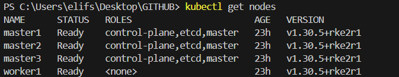

## Install and Configure RKE2

#### Add First Server Node

Connect to the master1 node

```bash
vagrant ssh master1
```

Change to root user

```bash
sudo -i
```

First, you must create the directory where the RKE2 config file is going to be placed

```bash
mkdir -p /etc/rancher/rke2/
```

Next, create the RKE2 config file at /etc/rancher/rke2/config.yaml.

> [!NOTE] 
> If you do not specify a pre-shared secret, RKE2 will generate one and place it at /var/lib/rancher/rke2/server/node-token.

> [!NOTE] 
> Don't forget to change the following IPs with yours.

```bash
cat << EOF > /etc/rancher/rke2/config.yaml
tls-san:
  - 192.168.68.60
  - loadbalancer
node-ip: "192.168.68.53"
write-kubeconfig-mode: "0644"
EOF
```

> [!NOTE] 
> Customizing these options allows you to better control and optimize your cluster’s behavior, especially in more advanced or production setups.
> https://docs.rke2.io/reference/server_config
> https://docs.rke2.io/reference/linux_agent_config

After that, you need to run the install command and enable and start rke2

```bash
curl -sfL https://get.rke2.io | sh -
systemctl enable rke2-server.service
systemctl start rke2-server.service
```

You will find the token generated by rke2 here, use it in next server nodes.

```bash
cat /var/lib/rancher/rke2/server/node-token
```

#### Add Next Server Nodes

Connect to the master2 node

```bash
vagrant ssh master2
```

Change to root user

```bash
sudo -i
```

Create same folder in next server node

```bash
mkdir -p /etc/rancher/rke2/
```

> [!NOTE] 
> I know no need to mention, but don't share your sensitive data (token, secret, ip etc.) publicly if you're in production environment:).

Create config file

```bash
cat << EOF > /etc/rancher/rke2/config.yaml
token: "K10bfdf9d8e3d1574625dfd4b637c6ef0cf771aef70abc72e9b97e13073c24983d4::server:0412d67ccfeb87163e243f5b468fbbaf"
server: https://loadbalancer:9345
tls-san:
  - 192.168.68.60
  - loadbalancer
node-ip: "192.168.68.55"
write-kubeconfig-mode: "0644"
EOF
```

Install and start rke2

```bash
curl -sfL https://get.rke2.io | sh -
systemctl enable rke2-server.service
systemctl start rke2-server.service
```

Connect to the next node and perform the same steps. Just remember to change the node-ip in config file.

- Use root user
- Create rke2 folder
- Create config file

```bash
cat << EOF > /etc/rancher/rke2/config.yaml
token: "K10bfdf9d8e3d1574625dfd4b637c6ef0cf771aef70abc72e9b97e13073c24983d4::server:0412d67ccfeb87163e243f5b468fbbaf"
server: https://loadbalancer:9345
tls-san:
  - 192.168.68.60
  - loadbalancer
node-ip: "192.168.68.56"
write-kubeconfig-mode: "0644"
EOF
```
- Install and start rke2

#### Add Worker/Agent Node

Perform the same steps for agents as well.

- Use root user
- Create rke2 folder
- Create config file

```bash
cat << EOF > /etc/rancher/rke2/config.yaml
token: "K10bfdf9d8e3d1574625dfd4b637c6ef0cf771aef70abc72e9b97e13073c24983d4::server:0412d67ccfeb87163e243f5b468fbbaf"
server: https://loadbalancer:9345
node-ip: "192.168.68.57"
write-kubeconfig-mode: "0644"
EOF
```

Run the installer and start service

```bash
curl -sfL https://get.rke2.io | INSTALL_RKE2_TYPE="agent" sh -
systemctl enable rke2-agent.service
systemctl start rke2-agent.service
```

#### Control the Nodes and Pods

```bash
/var/lib/rancher/rke2/bin/kubectl \
        --kubeconfig /etc/rancher/rke2/rke2.yaml get nodes
```

Expected Output:

```
NAME      STATUS   ROLES                       AGE     VERSION
master1   Ready    control-plane,etcd,master   43m     v1.30.5+rke2r1
master2   Ready    control-plane,etcd,master   30m     v1.30.5+rke2r1
master3   Ready    control-plane,etcd,master   8m17s   v1.30.5+rke2r1
worker1   Ready    <none>                      90s     v1.30.5+rke2r1
```


```bash
/var/lib/rancher/rke2/bin/kubectl \
        --kubeconfig /etc/rancher/rke2/rke2.yaml get pods -n kube-system
```

Expected Output: 
```
NAME                                                   READY   STATUS      RESTARTS   AGE
cloud-controller-manager-master1                       1/1     Running     0          37m
cloud-controller-manager-master2                       1/1     Running     0          23m
cloud-controller-manager-master3                       1/1     Running     0          115s
etcd-master1                                           1/1     Running     0          37m
etcd-master2                                           1/1     Running     0          23m
etcd-master3                                           1/1     Running     0          89s
helm-install-rke2-canal-5qbfl                          0/1     Completed   0          37m
helm-install-rke2-coredns-8phnv                        0/1     Completed   0          37m
helm-install-rke2-ingress-nginx-7lrrx                  0/1     Completed   0          37m
helm-install-rke2-metrics-server-wtsmr                 0/1     Completed   0          37m
helm-install-rke2-snapshot-controller-c2t2w            0/1     Completed   2          37m
helm-install-rke2-snapshot-controller-crd-m4m4n        0/1     Completed   0          37m
helm-install-rke2-snapshot-validation-webhook-m4qc6    0/1     Completed   0          37m
kube-apiserver-master1                                 1/1     Running     0          37m
kube-apiserver-master2                                 1/1     Running     0          23m
kube-apiserver-master3                                 1/1     Running     0          112s
kube-controller-manager-master1                        1/1     Running     0          37m
kube-controller-manager-master2                        1/1     Running     0          23m
kube-controller-manager-master3                        1/1     Running     0          115s
kube-proxy-master1                                     1/1     Running     0          37m
kube-proxy-master2                                     1/1     Running     0          23m
kube-proxy-master3                                     1/1     Running     0          115s
kube-scheduler-master1                                 1/1     Running     0          37m
kube-scheduler-master2                                 1/1     Running     0          23m
kube-scheduler-master3                                 1/1     Running     0          115s
rke2-canal-djvnp                                       2/2     Running     0          24m
rke2-canal-mc7ff                                       2/2     Running     0          2m5s
rke2-canal-vhghl                                       2/2     Running     0          37m
rke2-coredns-rke2-coredns-7d8f866c78-8klt5             1/1     Running     0          37m
rke2-coredns-rke2-coredns-7d8f866c78-h749k             1/1     Running     0          24m
rke2-coredns-rke2-coredns-autoscaler-75bc99ff8-9ppsd   1/1     Running     0          37m
rke2-ingress-nginx-controller-258zz                    1/1     Running     0          36m
rke2-ingress-nginx-controller-4zmsv                    1/1     Running     0          23m
rke2-ingress-nginx-controller-mmnxd                    1/1     Running     0          93s
rke2-metrics-server-77fd97b84-mdrlp                    1/1     Running     0          36m
rke2-snapshot-controller-7dcf5d5b46-jhccp              1/1     Running     0          36m
rke2-snapshot-validation-webhook-bf7bbd6fc-xgcvl       1/1     Running     0          36m
```

#### Start Using kubeconfig file

Install kubectl by following [the steps in the official doc of kubernetes](https://kubernetes.io/docs/tasks/tools/install-kubectl-windows/) for Windows host.

Copy the file at **/etc/rancher/rke2/rke2.yaml** and save it to the directory **~/.kube/config** on your local machine.

In the kubeconfig file, the server directive is defined as localhost. Configure the server as the **DNS of your load balancer, on port 6443**. (The RKE2 Kubernetes API Server uses port 6443)

**config file (partly):**
```
apiVersion: v1
clusters:
- cluster:
    certificate-authority-data: XXXXXXX
    server: https://loadbalancer:6443
....
```

- Add loadbalancer hostname to "c:\Windows\System32\Drivers\etc\hosts". I'll also add the other machines to the hosts. (Your ip can be different)

**hosts file:**
```
....
# End of section
192.168.68.60 loadbalancer
192.168.68.53 master1
192.168.68.55 master2
192.168.68.56 master3
192.168.68.57 worker1
192.168.68.58 worker2
192.168.68.59 worker3
```

Now we can check our config file by running

```
kubectl get nodes
```



#### Troubleshooting

See logs to detect problem (change service name as rke2-agent.service for agents)

```bash
journalctl -u rke2-server.service -f
```

```bash
journalctl -xeu rke2-server.service
```

You can start again after running the scripts below. (Kill process and uninstall)
```bash
sudo /usr/local/bin/rke2-killall.sh
sudo /usr/local/bin/rke2-uninstall.sh
```