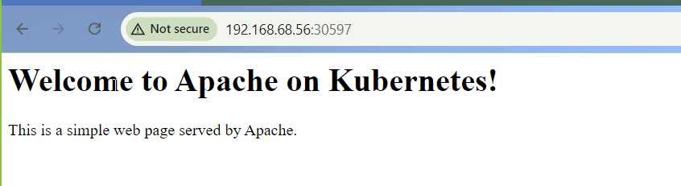

## Test The Cluster

#### Create an Apache Deployment

Create a file named apache-deployment.yaml then copy and paste the following content.

```yaml
apiVersion: apps/v1
kind: Deployment
metadata:
  name: apache-deployment
spec:
  replicas: 1
  selector:
    matchLabels:
      app: apache
  template:
    metadata:
      labels:
        app: apache
    spec:
      containers:
      - name: apache
        image: httpd:2.4
        ports:
        - containerPort: 80
        volumeMounts:
        - name: html-volume
          mountPath: /usr/local/apache2/htdocs/
      volumes:
      - name: html-volume
        configMap:
          name: apache-html
---
apiVersion: v1
kind: ConfigMap
metadata:
  name: apache-html
data:
  index.html: |
    <html>
      <head>
        <title>Apache Web Server</title>
      </head>
      <body>
        <h1>Welcome to Apache on Kubernetes!</h1>
        <p>This is a simple web page served by Apache.</p>
      </body>
    </html>
```

Apply the deployment in default namespace.

```bash
kubectl apply -f apache-deployment.yaml
```

Output:
```
PS C:\Users\elifs\Desktop\GITHUB> kubectl apply -f apache-deployment.yaml
deployment.apps/apache-deployment created
configmap/apache-html created
```

This will create a basic Apache deployment that serves a custom HTML page.


#### Expose Apache with a Service

Create a file named apache-service.yaml to expose Apache using NodePort

```yaml
apiVersion: v1
kind: Service
metadata:
  name: apache-service
spec:
  selector:
    app: apache
  ports:
    - protocol: TCP
      port: 80
      targetPort: 80
  type: NodePort
```

Apply the service in default namespace. 

```bash
kubectl apply -f apache-service.yaml
```

Output:
```
PS C:\Users\elifs\Desktop\GITHUB> kubectl apply -f apache-service.yaml
service/apache-service created
```

### Check the deployment, pod and the service

Check deployment

```bash
kubectl get deploy
```

Output:
```
PS C:\Users\elifs\Desktop\GITHUB\end-to-end-devops\rke2\hyperv> kubectl get deploy
NAME                READY   UP-TO-DATE   AVAILABLE   AGE
apache-deployment   1/1     1            1           105m
```

Check pods

```bash
kubectl get po
```

Output:
```
PS C:\Users\elifs\Desktop\GITHUB> kubectl get po
NAME                                 READY   STATUS    RESTARTS   AGE
apache-deployment-6db65656c4-v7tjk   1/1     Running   0          6m4s
```

Check Service 

```bash
kubectl get svc
```

Output:
```
PS C:\Users\elifs\Desktop\GITHUB> kubectl get svc
NAME             TYPE        CLUSTER-IP     EXTERNAL-IP   PORT(S)        AGE
apache-service   NodePort    10.43.80.124   <none>        80:30597/TCP   2m48s
kubernetes       ClusterIP   10.43.0.1      <none>        443/TCP        24h
```

#### Access the Apache Web Server

Get the NodePort assigned to the apache-service

```
kubectl get services
```

Look for apache-service and note the NodePort value (it will be in the range 30000–32767).

Access the Apache web server in your browser using the IP of any worker node and the NodePort

```bash
http://192.168.68.56:30597
```

You should see the custom "Welcome to Apache on Kubernetes" HTML page.
